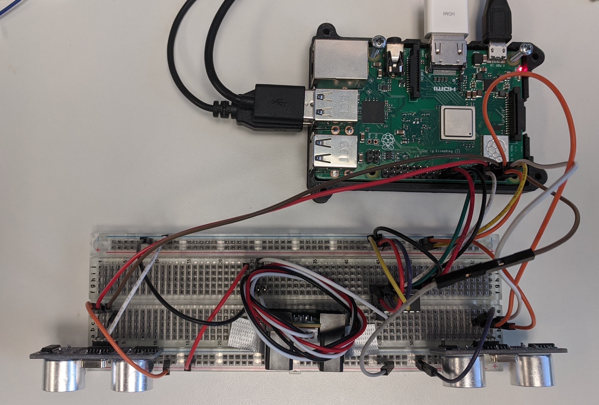
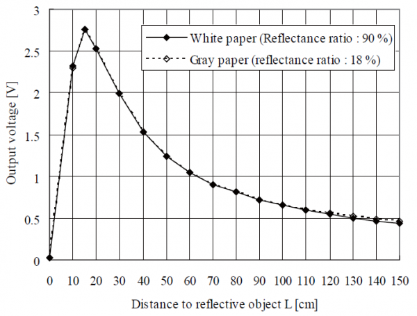
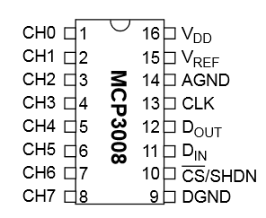
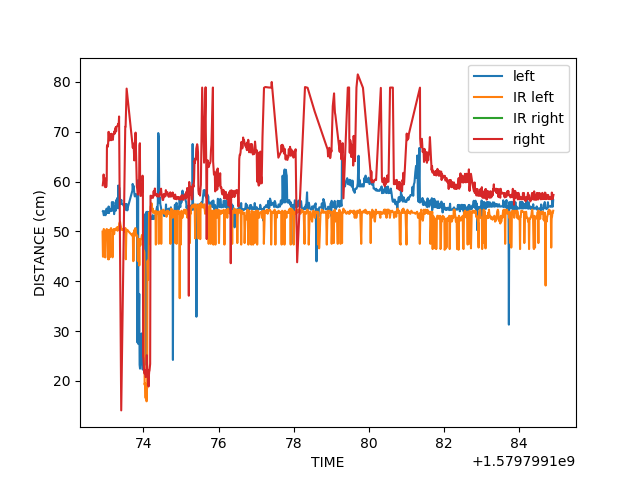
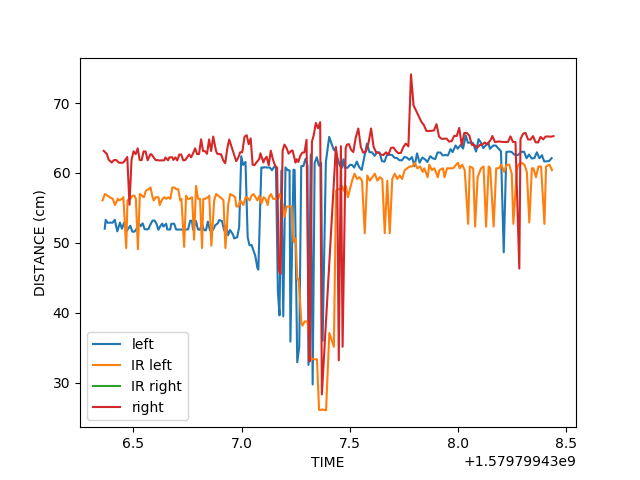
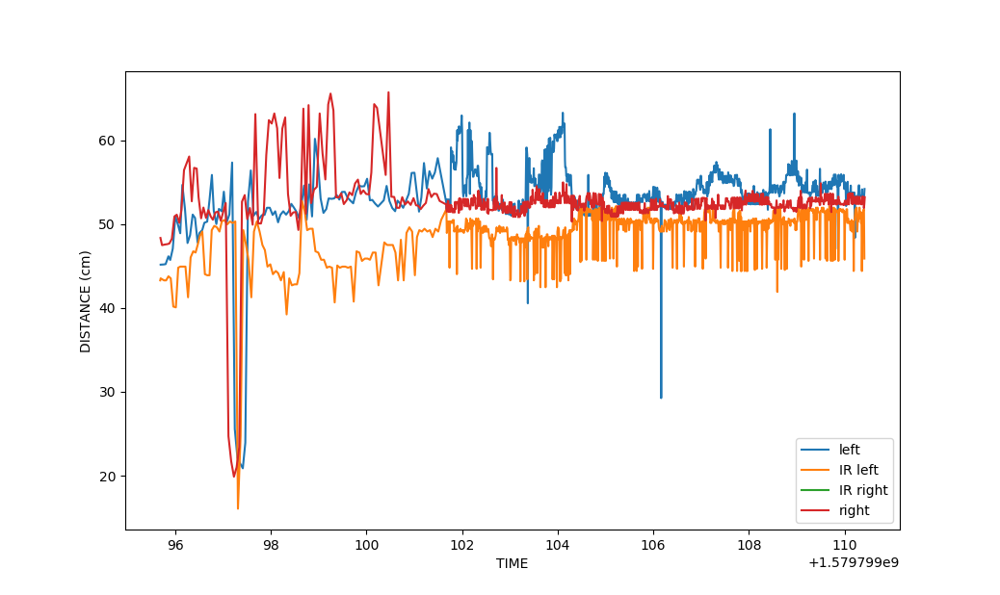
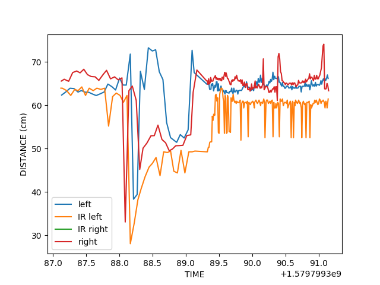

# ultrasonic-&-infrared-motion-detect
This repository is for raspberry pi + ultrasonic + infrared

## Installation
    - Prepare: raspberry pi + 2 ultrasonic + wires + breadboard
    - Connect 5v to "+" line
    - Connect Grand(Raspberry) to "-" line 
    - To setup SPI for the infrared sensor install:
    - pip3 install Adafruit_GPIO.SPI
    - pip3 install Adafruit_MCP3008
    - python3 ultraSummer.py in Raspberry Pi
    
### 2 ultrasonic implementation

### 2 ultrasonic + 1 IR implementation 

### Raspberry Pi Pin Map

### Attention
> "+", "-" line is for Gnd and UCC, Gnd is -, VCC +. This program use PIN number, not "GPIO" number. 
TRIG_2 =11 
ECHO_2 =7 
TRIG_1 =5
ECHO_1 =3
in ultraSummer.py

### About HC-SR04(ultrasonic sensor)
The HC-SR04 ultrasonic sensor uses SONAR to determine the distance of an object just like the bats do. It offers excellent non-contact range detection with high accuracy and stable readings in an easy-to-use package from ***2 cm to 400 cm*** or 1” to 13 feet

#### Technical Specifications
- Power Supply − +5V DC
- Quiescent Current − <2mA
- Working Current − 15mA
- Effectual Angle − <15°
- Ranging Distance − 2cm – 400 cm/1″ – 13ft
- Resolution − 0.3 cm
- Measuring Angle − 30 degree

## Max Distance 
HC-SR04 can detect untill 600cm

### About Sharp 2Y0A02 (Infrared Sensor)
The 2Y0A02 is similar to the HC-SR04, but uses infrared light to measure distance. It has a range between 20-150 cm.

#### Technical specifications
- Range: 20-150cm
- Consumption Current 33 mA
- Supply voltage 4.5 to 5,5 V

#### Accuracy with white and grey surfaces 

### About MCP3008 ADC 
The sharp infrared sensor outputs an analog signal, for this to be processed by the Raspberry pi we need to convert it to a digital signal. The MCP3008 does this for us, it has 8 channels that can convert an analog to a 10 bit digital signal. 

#### Wiring 
We utilized channel 1 for our IR sensor, but any of the 8 can be used. 
- VDD -> 3.3 V
- VREF -> 3.3 V
- AGN -> GND
- CLK -> GPIO18
- DOUT -> GPIO23
- DIN -> GPIO24
- CS/SHDN -> GPIO25
- DGND -> GND

## 3 Sensor Implementation

### Processing Data
We take input from all three sensors, a signal is generated which can be analysed. The combination of the signals forms a unique waveform that can then be matched to a specific gesture.

### Graphing the Outputs
There are 2 ways we can categorize a swipe gesture. One is "wave" which is when ur palm is facing the sensors. The other is "natural", which is when ur fingertips are pointed at the sensors.
#### Swipe Left to Right
#### Wave gesture

#### Natural gesture

#### Swipe Right to Left
##### Wave gesture

##### Natural Gesture

