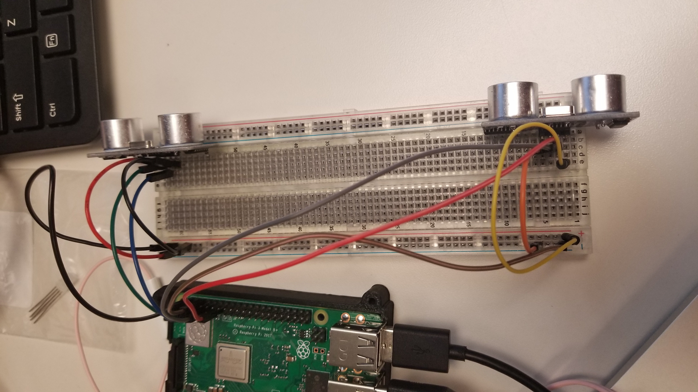
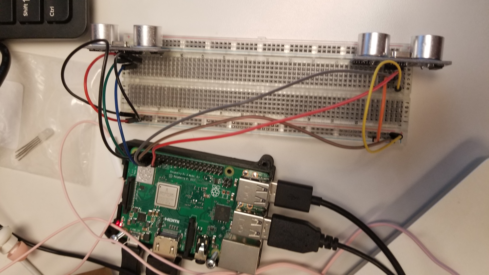
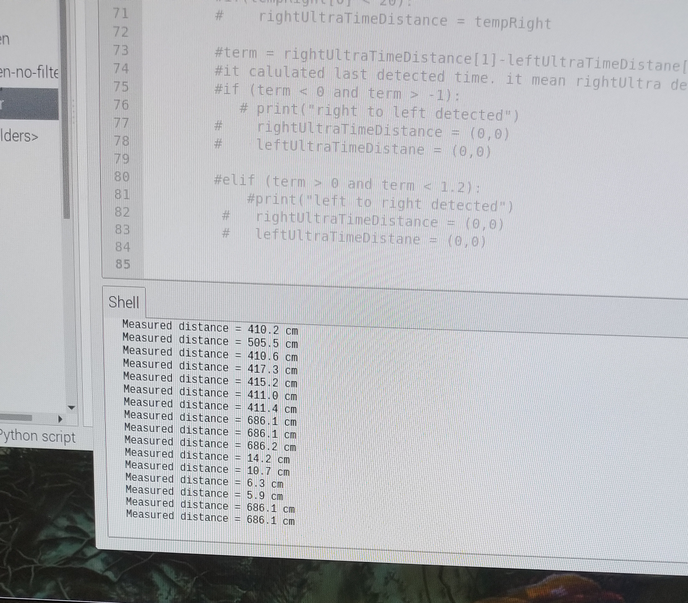

# ultrasonic-motion-detect
This repository is for raspberry pi + ultrasonic.

## Installation
    - Prepare: raspberry pi + 2 ultrasonic + wires + breadboard
    - Connect 5v to "+" line
    - Connect Grand(Raspberry) to "-" line 
    - python3 ultraSummer.py in Raspberry Pi

### Raspberry Pi Pin Map

### Attention
> "+", "-" line is for Gnd and UCC, Gnd is -, VCC +. This program use PIN number, not "GPIO" number. 
TRIG_2 =11 
ECHO_2 =7 
TRIG_1 =5
ECHO_1 =3
in ultraSummer.py

### About HC-SR04(ultrasonic sensor)
The HC-SR04 ultrasonic sensor uses SONAR to determine the distance of an object just like the bats do. It offers excellent non-contact range detection with high accuracy and stable readings in an easy-to-use package from ***2 cm to 400 cm*** or 1” to 13 feet

#### Technical Specifications
- Power Supply − +5V DC
- Quiescent Current − <2mA
- Working Current − 15mA
- Effectual Angle − <15°
- Ranging Distance − 2cm – 400 cm/1″ – 13ft
- Resolution − 0.3 cm
- Measuring Angle − 30 degree

## Max Distance 
HC-SR04 can detect untill 600cm

