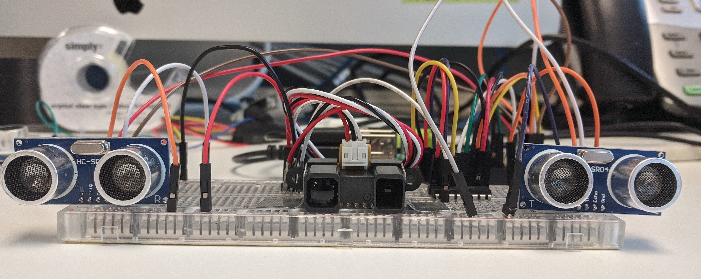
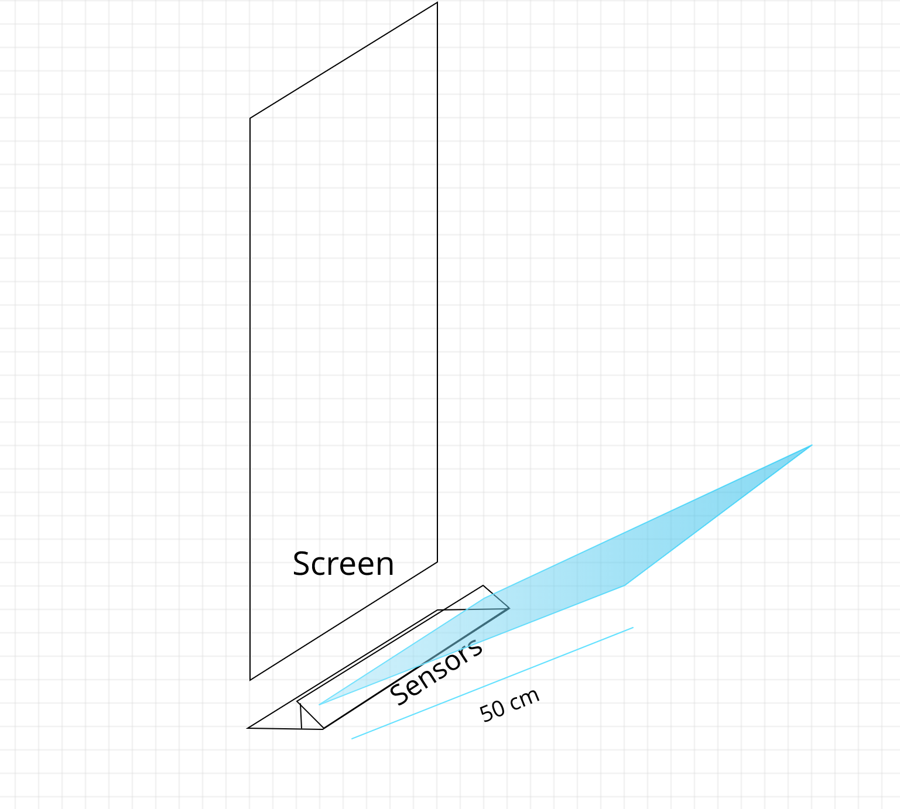
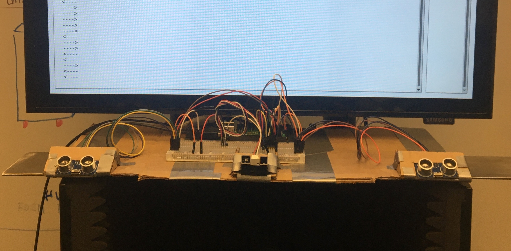
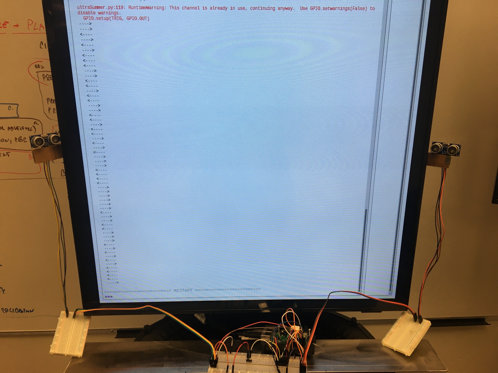
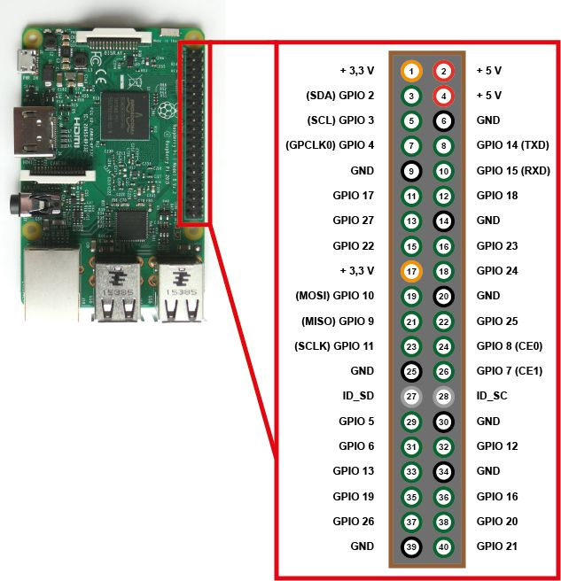
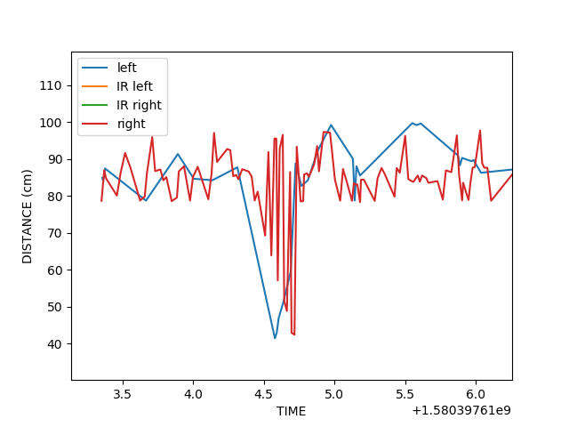
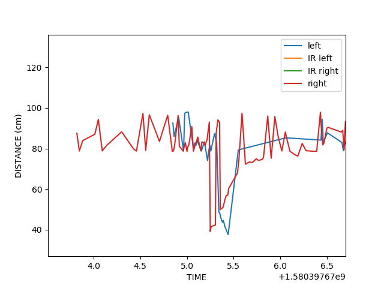
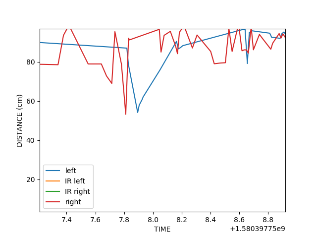
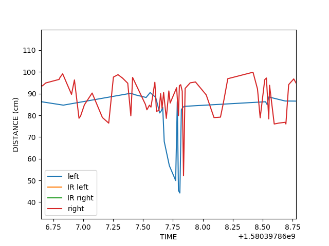
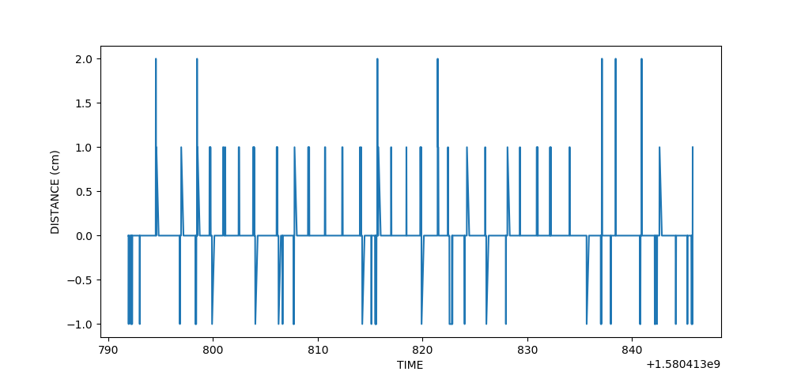

# ultrasonic-&-infrared-motion-detect
This repository is for raspberry pi + ultrasonic + infrared

## Installation
    - Prepare: raspberry pi + 2 ultrasonic + wires + breadboard
    - Connect 5v to "+" line
    - Connect Grand(Raspberry) to "-" line 
    - To setup SPI for the infrared sensor install:
    - pip3 install Adafruit_GPIO.SPI
    - pip3 install Adafruit_MCP3008
    - python3 ultraSummer.py in Raspberry Pi
    

### 2 ultrasonic + 1 IR implementation 

### Sensor Packaging 
#### Angled Sensor Mount
We place the sensors as described in the gesture design documentation but apply a simple modification of angling it upward. 
##### Calibration 
These variables can be modified to better perform under different environments.
- Maximum Distance: 50 cm
- Delay: 0.5 seconds
- Timeout: 0.3 seconds

#### Side Sensor Mount
>We also explored placing the sensors on the sides of the TV screen. This implementation was not as effective. 

### Raspberry Pi Pin Map

### Attention
> "+", "-" line is for Gnd and UCC, Gnd is -, VCC +. This program use PIN number, not "GPIO" number. 
TRIG_2 =11 
ECHO_2 =7 
TRIG_1 =5
ECHO_1 =3
in ultraSummer.py

### About HC-SR04(ultrasonic sensor)
The HC-SR04 ultrasonic sensor uses SONAR to determine the distance of an object just like the bats do. It offers excellent non-contact range detection with high accuracy and stable readings in an easy-to-use package from ***2 cm to 400 cm*** or 1” to 13 feet

#### Technical Specifications
- Power Supply − +5V DC
- Quiescent Current − <2mA
- Working Current − 15mA
- Effectual Angle − <15°
- Ranging Distance − 2cm – 400 cm/1″ – 13ft
- Resolution − 0.3 cm
- Measuring Angle − 30 degree

### About Sharp 2Y0A02 (Infrared Sensor)
The 2Y0A02 is similar to the HC-SR04, but uses infrared light to measure distance. It has a range between 20-150 cm.

#### Technical specifications
- Range: 20-150cm
- Consumption Current 33 mA
- Supply voltage 4.5 to 5,5 V

#### Accuracy with white and grey surfaces 

### About MCP3008 ADC 
The sharp infrared sensor outputs an analog signal, for this to be processed by the Raspberry pi we need to convert it to a digital signal. The MCP3008 does this for us, it has 8 channels that can convert an analog to a 10 bit digital signal. 

#### Wiring 
We utilized channel 1 for our IR sensor, but any of the 8 can be used. 
- VDD -> 3.3 V
- VREF -> 3.3 V
- AGN -> GND
- CLK -> GPIO18
- DOUT -> GPIO23
- DIN -> GPIO24
- CS/SHDN -> GPIO25
- DGND -> GND

## 3 Sensor Implementation

### Processing Data
We take input from all three sensors, a signal is generated which can be analysed. The combination of the signals forms a unique waveform that can then be matched to a specific gesture.

### Graphing the Outputs
Inorder to better understand the system and how to go about detecting for different gestures, there are 2 different functions that plot the data from the sensors. The rawPlot() will create a graph like the ones seen below, where the raw distance data is pulled from the sensors and plotted versus time. The dataPlotting() function processes the data and plots the output signal.
There are 2 ways we can categorize a swipe gesture. One is "wave" which is when ur palm is facing the sensors. The other is "natural", which is when ur fingertips are pointed at the sensors.
#### Swipe Left to Right
The opposite is true going from right to left
#### Wave gesture

#### Natural gesture

#### Mounted Sensor 
When only using the 2 ultrasonic sensors mounted to the side of the TV screen:
##### Left to right Wave

##### Right to left Wave

##### Left to right Natural

##### Right to left Natural

#### Testing Setup
We have a built in testing function that allows you to run through a random series of gestures and the system checks for whether or not they were correct. The result is then outputed, using swipeDetectTest(n). Where n is the number of trials. On completion the function also generates a processed data plot for further analysis. 

